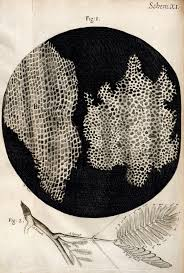

# History of Cell Biology: 1665 - Present (2026)
A comprehensive timeline and educational resource documenting the milestones of cellular discovery.

---

## 📊 Statistics
* **Total Discoveries/Milestones:** 21
* **Time Span:** 1665 – 2024
* **Total Years Covered:** 360

### Discoveries by Century
* **17th Century:** 2 discoveries
* **19th Century:** 6 discoveries
* **20th Century:** 8 discoveries
* **21st Century:** 5 discoveries

---

## 📅 Complete Timeline

### 17th Century
* **1665 | Robert Hooke**
  * **Discovery:** First observation of 'cells' in cork tissue.
  * **Significance:** Named cellular structures; foundation of cell biology.
  * **Location:** England
 ## * 
  * This is the image of Cork Cells observed by Robert Hooke
* **1674 | Antonie van Leeuwenhoek**
  * **Discovery:** Observed microscopic organisms (protozoa and bacteria).
  * **Significance:** Revealed the existence of unicellular organisms.
  * **Location:** Netherlands

### 19th Century
* **1804 | Jean-Baptiste Lamarck**
  * **Discovery:** Proposed cells are the basic unit of life.
  * **Significance:** Early cell theory foundation.
* **1831 | Robert Brown**
  * **Discovery:** Identified the cell nucleus in orchids.
  * **Significance:** Revealed nucleus as the cell's central organelle.
* **1839 | Matthias Schleiden & Theodor Schwann**
  * **Discovery:** Formulated Cell Theory.
  * **Significance:** Established that all organisms are made of cells.
* **1858 | Rudolf Virchow**
  * **Discovery:** *'Omnis cellula e cellula'* (all cells from cells).
  * **Significance:** Completed the basic cell theory.
* **1880 | Various Scientists**
  * **Discovery:** Identification of organelles (mitochondria, chloroplasts).
  * **Significance:** Understanding of cellular compartmentalization.
* **1898 | Camillo Golgi**
  * **Discovery:** Identified the Golgi apparatus.
  * **Significance:** Revealed protein processing and packaging organelle.

### 20th Century
* **1902 | Sutton & Boveri:** Chromosomal theory of inheritance.
* **1944 | Oswald Avery:** DNA identified as genetic material.
* **1953 | Watson, Crick, Franklin & Wilkins:** DNA double helix structure revealed.
* **1970 | Lynn Margulis:** Endosymbiotic theory refined (Origins of mitochondria).

### 21st Century
* **2003 | International Consortium:** Human Genome Project completed.
* **2012 | Doudna & Charpentier:** CRISPR-Cas9 gene editing refined.
* **2024 | Ongoing Research:** Artificial cells and synthetic biology.

---

### 💡 Conclusion
This repository serves as a functional and historical proof that the **cell is the structural and functional unit of life**. By tracking these discoveries, we see how the human understanding of life shifted from "visible organs" to "microscopic units."
